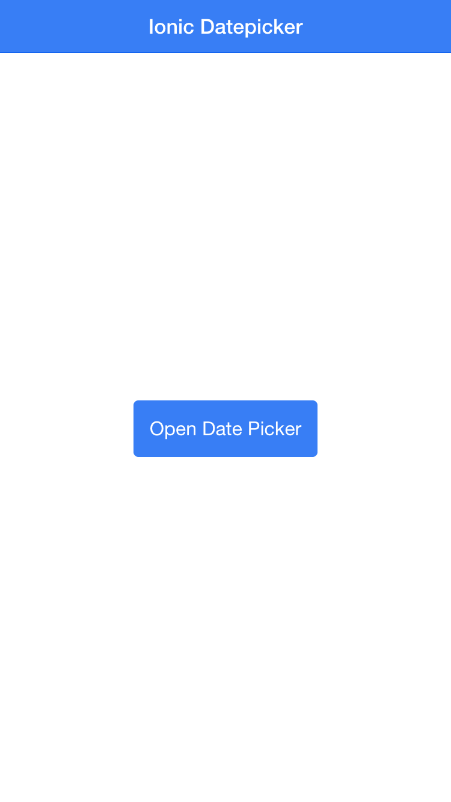

# ionic-modal-datepicker

Simple Datepicker for [Ionic](http://ionicframework.com/)

## Features

* simple
* easy to customize
* backed by [momentJS](http://momentjs.com/), including all l18n / i10n features
* watchable configuration (it can change whenever you want it to change)
* from-to timeframe
* deactivate custom days
* flexible styling, custom button labels
* nice modal datepicker (for Ionic)
* Dont forget to include other needed dependencies like momentJS

>
``` JavaScript
angular.module('starter', ['ionic', 'angularMoment', 'ionic-datepicker'])
```
## Possible options

animation: 'slide-in-up'

scope: create a new from $rootScope by default

focusFirstInput: false
backdropClickToClose: true
hardwareBackButtonClose: true

initial: 'YYYY-MM-DD' format (default: today)

format: return value format (default: 'YYYY-MM-DD')
weekdayFormat: format of weekday header (default: 'dd')

from: 'YYYY-MM-DD' format (default: infinity)
to: 'YYYY-MM-DD' format (default: infinity)

activeDays: [ 'YYYY-MM-DD', 'YYYY-MM-DD', .. ] (default: empty, all days are selectable)

onSelected: function callback
onClose: function callback

labels: { 'closeButton': 'OK', prevButton: '<', nextButton: '>' }


## Screenshots

